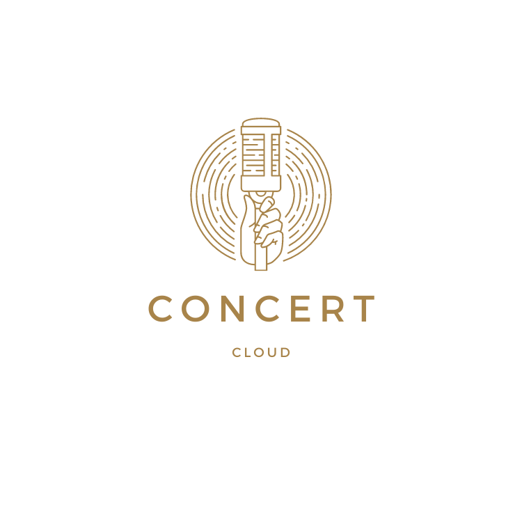

# project-1-group-b
## Concert Cloud Development Team Members
[Tracy Angell](https://github.com/tracye1083), [David Bernard](https://github.com/dbernard87), [Brendan Kurylo](https://github.com/Bkrendan12) & [Luke Teal](https://github.com/luketeal)
***
## Title
Concert Cloud
***
## Description

*** 
## User Stories
- As Billy Bob, I want to check what country concerts are in the area, so that I can buy tickets
- As Sophia, I want to check the weather on a date of a concert, so i can plan my outfit accordingly
***
## Features
- Search upcoming concerts in a specific city
- Refine search by selecting a Genre
- View forcasted weather for the day of the concert
- Link to be redirected so the user can purchase concert tickets
***
## Resources 
Concert Cloud was created using:
- HTML
- Bulma CSS Framework
- JavaScript
    - jQuery
    - Day.js
- Google Fonts
- GitHub
- Servier-side APIs
    - [Ticketmaster](https://developer.ticketmaster.com/) for concert details and redirect to purchase tickets
    - [Visual Crossing](https://www.visualcrossing.com/) for weather data
***
## Processes Followed
- Git branching workflow
- Git issues and Kanban tasks to manage project work daily
***
## Screenshots

***
## URL

